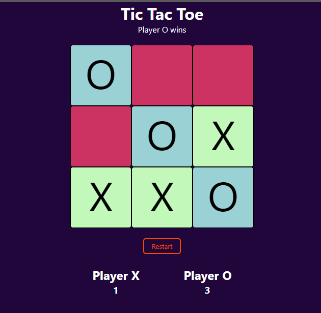

# TicTacToe



Simples jogo da velha criado utilizando [Angular CLI](https://github.com/angular/angular-cli) versão 14.1.2.

## Rodando o projeto

Após clonar o projeto utilizando `git clone https://github.com/Matheus8560/angular-tic-tac-toe.git`. Rode os seguintes comandos:

```
npm install
ng serve
```

Depois basta navegar para `http://localhost:4200/`.
